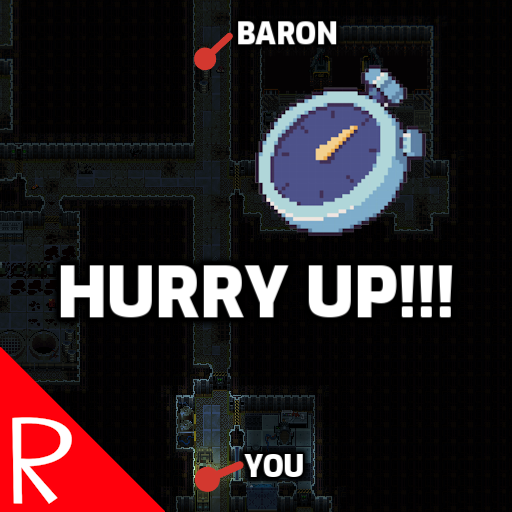

# Quasimorph Hold To Skip Turn

Have you ever been spamming the space bar because a baron was taking forever to reach you?  Perhaps during that spamming accidently skipped a turn and now the baron is now three tiles closer?

Maybe instead it was on a defense mission, or guarding a stockpile?

This mod allows the user to hold down the space bar (or whatever the game's Skip Turn key is currently bound to) to skip turns until an enemy is seen or detected.

The auto skipping will occur once the user has held down the space bar for one second, and then every quarter of a second after that.  It will stop when space bar is released or an enemy is seen or detected.

**Important:** The game doesn't stop the player from moving or skipping turns even if they have taken damage. This mod works the same was. I'm looking into making the auto skipping stop.

# Configuration
The mod's configuration can be changed on the Main Menu -> Mods -> WaitForEnemy.

If MCM is not installed, the configuration file can be directly edited at `%UserProfile%\AppData\LocalLow\Magnum Scriptum Ltd\Quasimorph_ModConfigs\HoldToSkipTurn\config.json`
\config.json`, and will be created on the first game run.

|Name|Default|Description|
|--|--|--|
|SkipTurnHoldDelay|1000|The delay in milliseconds the skip key must be held before this mod auto skips turns.|
|SkipRepeatDelay|250|When skip turn is held down, this is the delay in milliseconds before the action is repeated.|

# Enjoy the Mods?
If you enjoy my mods and want to buy me a coffee, check out my [Ko-Fi](https://ko-fi.com/nbkredspy71915) page.
Thank you!

# Source Code
Source code is available on GitHub at https://github.com/NBKRedSpy/QM_HoldToSkipTurn

# Change Log
Source code is available on GitHub at https://github.com/NBKRedSpy/QM_HoldToSkipTurn/blob/main/CHANGELOG.md
